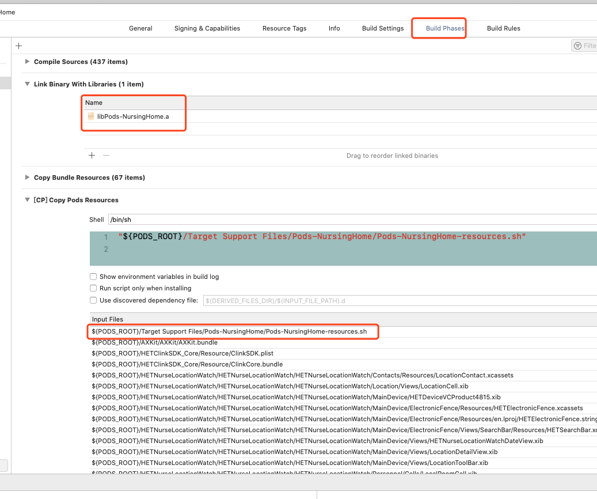

1. **Cocopods原理解析:** 

   - 1.当使用 CocoaPods 导入私有库时，CocoaPods 先是根据:git => 'https://github.com/xiaofei86/LPLineChartView.git'找到对应的 Git 仓库，然后根据:tag => '1.0.0'定位到对应 tag 的提交（如果没有注明 Pod 依赖库版本则定位到最后一次的提交） 

   - 2.然后在这次提交中检索到后缀为“.podspec”的文件（文件可以随便命名）。找到 Podspec 文件后先要验证 [s.name](http://s.name/) 是否与Podfile中的一致，如果不一致则 install 时会报错“[!] Unable to find a specification for 'LPLineChartView'.” 

   - 3.验证成功后，就会根据 Podspec 中的 s.source_files 找到需要导入代码文件，并通过其他的数据找到对应的配置文件或资源文件等。

   - 4.最后，将其下载到本地项目中

     

2. **集成原理** 

   1. Pods 项目最终会编译成一个名为 libPods.a 的文件，主项目只需要依赖这个.a文件即可
   2. 对于资源文件，CocoaPods 提供了一个名为 [Pods-resources.sh](http://pods-resources.sh/) 的 bash 脚本，该脚本在每次项目编译的时候都会执行，将 Pods 依赖库的各种资源文件复制到目标目录中。CocoaPods 还通过一个名为 Pods.xcconfig 的文件来在编译时设置所有的依赖和参数。 
   3. 

3. **Podfile.lock 文件**

   1. 执行完 pod install 之后，CocoaPods会生成一个名为 Podfile.lock 的文件
   2. Podfile.lock 文件最大得用处在于多人开发。团队中的某个人执行完 pod install 命令后，生成的 Podfile.lock 文件就记录下了当时最新 Pods 依赖库的版本，这时团队中的其它人 check 下来这份包含 Podfile.lock 文件的工程以后，再去执行 pod install 命令时，获取下来的 Pods 依赖库的版本就和最开始用户获取到的版本一致。
   3. 如果没有 Podfile.lock 文件，后续所有用户执行 pod install 命令都会获取最新版本的 LPLineChartView，这就有可能造成同一个团队使用的依赖库版本不一致，这对团队协作来说绝对是个灾难！
   4. 解决方案:如果团队想使用当前最新版本的 LPLineChartView 依赖库，有两种方案：1.更改 Podfile，使其指向最新版本的 LPLineChartView 依赖库；2.执行 pod update 命令；鉴于 Podfile.lock 文件对团队协作如此重要，所以应该加入到版本控制里面（This file should always be kept under version control）。

4. **命令总结**

   1. CocoaPods 在执行 pod install 和 pod update 时，会默认先更新一次 Podspec 索引。使用 --no-repo-update 参数可以禁止其做索引更新操作

      > ```objective-c
      > pod install --no-repo-update
      > pod update --no-repo-update
      > ```

   2. 查看细节 => 了解底层运行过程最简单的方式

      >```objective-c
      >pod install --verbose
      >pod update --verbose
      >```

5. **管理Pods依赖库版本**

   1. pod 'LPLineChartView'                //不显式指定依赖库版本，表示每次都获取最新版本
      pod 'LPLineChartView', '2.0'        //只使用2.0版本
      pod 'LPLineChartView', '> 2.0'      //使用大于2.0的版本
      pod 'LPLineChartView', '>= 2.0'     //使用大于或等于2.0的版本
      pod 'LPLineChartView', '< 2.0'      //使用小于2.0的版本
      pod 'LPLineChartView', '<= 2.0'     //使用小于或等于2.0的版本
      pod 'LPLineChartView', '~> 0.1.2'   //使用大于等于0.1.2但小于0.2的版本
      pod 'LPLineChartView', '~> 0.1'     //使用大于等于0.1但小于1.0的版本
      pod 'LPLineChartView', '~> 0'        //使用大于0的版本，和什么都不写效果相同

6. ##### 创建.podspec

   首先在你的项目中使用如下命令创建名为 LPPushService 的 LPPushService.podspec（当然你也可以使用vim创建，只是没有默认文本而已）

   

   ```ruby
   $ pod spec create LPPushService
   ```

7. **编辑.podspec**

创建好的 .podspec 包含大量的注释说明了每个参数的含义及用法。如果想详细了解可以仔细阅读。这里只介绍几个常用的。

 

```jsx
Pod::Spec.new do |s|

  s.name                = "LPPushService"
  s.version             = "1.0.0"
  s.summary             = "integrate APNs rapidly"
  s.homepage            = "https://github.com/xiaofei86/LPPushService"
  s.license             = { :type => "MIT", :file => "LICENSE" }
  s.author             = { "XuYafei" => "xuyafei86@163.com" }
  s.social_media_url   = "http://xuyafei.cn"
  s.platform            = :ios, "7.0"
  s.source              = { :git => "https://github.com/xiaofei86/LPPushService.git", :tag => s.version }
  s.source_files        = "LPPushService/**/*.{h,m}"
  s.resources          = "LPPushService/Images/*.png"
  s.dependency          "BPushSDK", "1.4.1"
  s.requires_arc        = true

end
```

s.name：名称，pod search 搜索的关键词
 s.version：版本
 s.summary：简介，pod search 搜索的关键词
 s.homepage：主页地址，例如Github地址
 s.license：许可证
 s.author：作者
 s.social_media_url：社交网址
 s.platform：平台
 s.source：Git仓库地址，例如在Github地址后边加上 .git 就是Git仓库地址，常见写法如下
 s.source_files：需要包含的源文件，常见的写法如下
 s.resources：需要包含的图片等资源文件
 s.dependency：依赖库，不能依赖未发布的库
 s.dependency：依赖库，如有多个可以这样写
 s.requires_arc：是否要求ARC

**s.source_files 常见写法**

```bash
"Directory1/*"
"Directory1/Directory2/*.{h,m}"
"Directory1/**/*.h"
```

- “*” 表示匹配所有文件
- “*.{h,m}” 表示匹配所有以.h和.m结尾的文件
- “**” 表示匹配所有子目录

**s.source 常见写法**

```jsx
s.source = { :git => "https://github.com/xiaofei86/LPPushService.git", :commit => "68defea" }
s.source = { :git => "https://github.com/xiaofei86/LPPushService.git", :tag => 1.0.0 }
s.source = { :git => "https://github.com/xiaofei86/LPPushService.git", :tag => s.version }
```

- commit => "68defea" 表示将这个Pod版本与Git仓库中某个commit绑定
- tag => 1.0.0 表示将这个Pod版本与Git仓库中某个版本的comit绑定
- tag => s.version 表示将这个Pod版本与Git仓库中相同版本的comit绑定

按照上述规则编辑完成就制作好了 .podspec（最好使用vim进行编辑）。

8. **上传到Git**

将包含配置好的 .podspec 的项目提交 Git，并给这次提交打上 tag，这时就可以在其他项目中使用 CocoaPods 引入你配置好的 Pod 了。

```jsx
pod 'LPPushService', :git => 'https://github.com/xiaofei86/LPPushService.git', :tag => '1.0.0'
```

当然，在给其他项目使用前最好先<a href="##*验证.podspec">*验证.podspec</a>的有效性。

##### 验证.podspec

编辑好后最好先验证 .podspec 是否有有效

```ruby
$ pod spec lint LPPushService.podspec
```

验证过程中：

```rust
 -> LPPushService
```

验证成功后：

```css
LPPushService.podspec passed validation.
```

验证失败后：

```csharp
[!] The spec did not pass validation, due to 1 error.
```

验证 .podspec 会先测试本地 .podspec 文件是否存在语法错误。测试成功再根据 .podspec 文件找到远端仓库对应的版本克隆到本地并进行配置。最后测试文件是否能够编译成功。

9. **podspec验证失败错误排查**

### 语法错误

如果是因为语法错误，验证失败后会给出错误的准确定位


```csharp
[!] Invalid `LPPushService.podspec` file: no .<digit> floating literal anymore; put 0 before dot
  s.version      = “1.0.0”
                        ^
LPPushService.podspec:5: syntax error, unexpected tFLOAT, expecting '('
  s.version      = “1.0.0”
                           ^
```

标记“^”的地方即为有语法错误的地方。

上述错误是因为使用“文本编辑”进行编辑造成的。使用文本编辑有时候英文""引号会自动变成中文“”引号。

```cpp
[!] Your Podfile has had smart quotes sanitised. To avoid issues in the future, you should not use TextEdit for editing it. If you are not using TextEdit, you should turn off smart quotes in your editor of choice.
```

使用 vim 将其改为英文的""引号即可。

##### 依赖错误

但是，有些非语法错误是不会给出错误原因的。这个时候可以使用“--verbose”来查看详细的验证过程来帮助定位错误。

```css
pod spec lint LPPushService.podspec --verbose
```

如下错误通过 --verbose 就可以找到原因。

```php
 -> LPPushService (1.0.0)
    - ERROR | [iOS] Encountered an unknown error (The 'Pods' target has transitive dependencies that include static binaries: (/private/var/folders/jz/b_m3k7ln47524cm__h3__mk00000gn/T/CocoaPods/Lint/Pods/BPushSDK/LibBPush/libBPush.a)) during validation.
```

这个错误是因为依赖库（s.dependency）包含了.a静态库造成的。虽然这并不影响Pod的使用，但是验证是无法通过的。可以通过 --use-libraries 来让验证通过。

```css
pod spec lint LPPushService.podspec --verbose --use-libraries
```

这种情况下使用 --use-libraries 虽然不会出现错误（error），但是有时候会带来一些警告（waring），警告同样是无法通过验证的。这时可以用 --allow-warnings 来允许警告。


```css
pod spec lint LPPushService.podspec --verbose --use-libraries --allow-warnings
```

##### 安装错误

如果在其他项目 pod install 的过程中，出现包含“undefined method `end_with?' for nil”字样的报错。进入“~/.cocoapods/repos”目录，删除“master”，并将 master-1 改为 master 即可。

如果出现如下错误，而你的验证可以通过，那么一般更新下版本号就可以解决。

```csharp
[!] Unable to find a specification for 'LPPushService'.
```

##### 再次验证

如果错误发生在 .podspec 中。当修改完时，不需要再次提交就可以直接验证。如果错误发生在代码中，则需要再次提交才能验证。

##### 发布到CocoaPods

你可以用 .podspec 文件来方便的管理内部代码，当然，也可以发布自己的 Pod 供其他开发者使用。

CocoaPods 0.33中加入了 Trunk 服务，使用 Trunk 服务可以方便的发布自己的Pod。虽然一开始使用 GitHub Pull Requests 来整理所有公共 pods 效果很好。但是，随着 Pod 数量的增加，这个工作对于 spec 维护人员 Keith Smiley 来说变得十分繁杂。甚至一些没有通过 $ pod lint 的 spec 也被提交上来，造成 repo 无法 build。CocoaPods Trunk 服务的引入，解决了很多类似的问题。每次使用 Trunk 服务发布 Pod 时都会通过 $ pod lint 验证 .podspec 是否有效。要想使用 Trunk 服务，首先需要使用如下命令注册自己的电脑。这很简单，只要你指明你的邮箱地址（spec文件中的）和名称即可。CocoaPods 会给你填写的邮箱发送验证邮件，点击邮件中的链接就可通过验证。

```css
pod trunk register xuyafei86@163.com "XuYafei"
```

然后就可以发布你的 Pod 了。

```css
pod trunk push LPPushService.podspec
```

发布时会验证 Pod 的有效性，如果你在手动验证 Pod 时使用了 --use-libraries 或 --allow-warnings 等修饰符，那么发布的时候也应该使用相同的字段修饰，否则出现相同的报错。

```css
pod trunk push LPPushService.podspec --use-libraries --allow-warnings
```

发布成功后，就可以使用 pod search 搜索到你的 Pod 了！


```csharp
-> LPPushService (1.0.0)
   integrate APNs rapidly
   pod 'LPPushService', '~> 1.0.0'
   - Homepage: https://github.com/xiaofei86/LPPushService
   - Source:   https://github.com/xiaofei86/LPPushService.git
   - Versions: 1.0.0 [master repo]
```

由于 pod search 是搜索的本地“~/.cocoapods”，所以在其他设备上可能无法搜到。这时只需要执行 pod install 更新下 pod 仓库即可（不要加 --no-repo-update）。

##### 版本升级

当需要更新 Pod 版本的时候，修改 .podspec 中的 s.version 为更高的版本号，并修改 s.source 中对应的 Git 版本。提交到Git，并打上对应tag。然后再次执行`pod trunk push LPPushService.podspec`将新的 .podspec 发布到 CocoaPods。更新完成！

为了更新更加方便，版本控制更加清晰，s.source 建议采用如下写法：


```jsx
s.source = { :git => "https://github.com/xiaofei86/LPPushService.git", :tag => s.version }
```

这样写将 Git 的版本与 CocoaPods 的版本进行了绑定。每次提交后再给本次提交打上 tag 就完成了更新。而且在 Git 中就可以清晰的看到哪次提交对应的哪个 CocoaPods 版本。如果与 commit 绑定，则要通过两次提交才能完成更新，第一次先提交修改代码，第二次将上一次 commit id 更新到 s.source 然后再次提交。如果直接与固定 tag 绑定，则每次还都要修改 s.source。如果你的 Pod 是私有库，那么 s.source 其实是无用的。因为在 Podfile 中已经指明了地址和版本（如下）。这时 s.source 可以随便填写，但最好还是按照上述规则以便以后发布。

```jsx
pod 'LPPushService', :git => 'https://github.com/xiaofei86/LPPushService.git', :tag => 1.0.0
```

[参考文档连接 --作者：xuyafei86](作者：xuyafei86链接：https://www.jianshu.com/p/fb202af858fd来源：简书著作权归作者所有。商业转载请联系作者获得授权，非商业转载请注明出处。)

